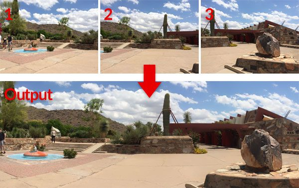
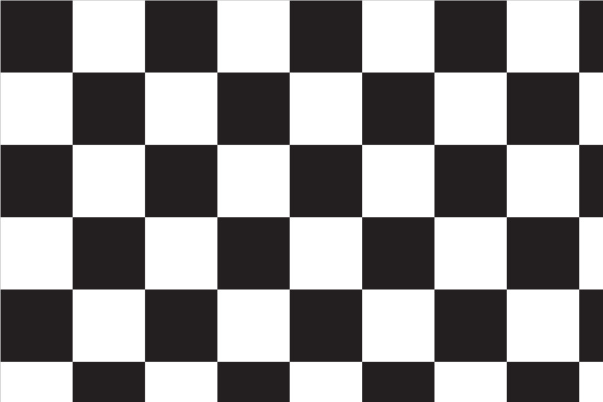
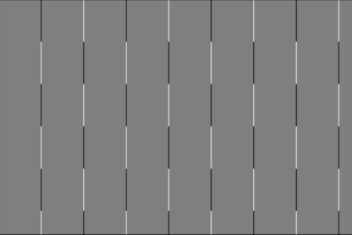
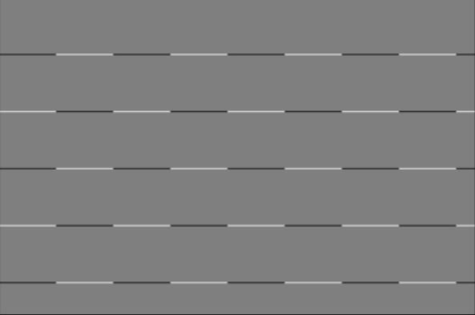
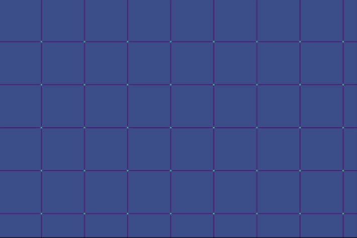
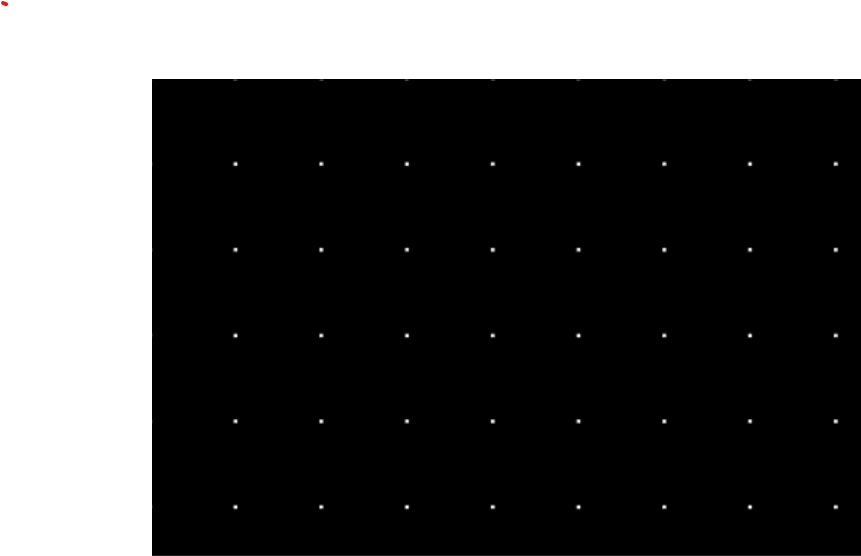

# Harris Corner Detection

## Introduction
The ability to discover corners in an image forms an important basis for the field of image processing. Corners represent points of interest in an image. If you were to assign points to edges in an image, this would take quite a long time, as edges are arbitrarily long. With corners, on the other hand, we are able to mark them with just one point.

Using a mesh of corners as an example, we are able to draw conclusions about the object type based on the distribution alone.
The image showing a 1 serves as an example. Even after marking the corners and removing the actual image, we are able to identify the object as a 1, knowing that it is a number.
Or we can stitch togehter multiple partial images to one big together even if they were not clean seperated just by finding markant corner meshs in the image pairs

## Alogrithm
The main concept of the Harris Corner Detection is to find the magnitudes of color change in all directions for every part of the image and evaluating the magnitudes using the harris corner response function.

Out goal is to find the corners in the picture of this chessboard:

To simplify the process in general it is recommended to convert colored images to grey-scale to speed up computation.

### Step 1: Create the X and Y derivation matrices using the sobel filter
We use the two Sobel cores Ix and Iy for this. These are moved step by step over the original image. The closer the individual fields are to each other, the more they cancel each other out. High colour changes, on the other hand, remain.

Sobel Kernel X: $$ Ix = \begin{bmatrix} -1 & 0 & 1  \\ -2 & 0 & 2 \\ -1 & 0 & 1 \end{bmatrix} $$

Sobel Kernel Y: $$ Iy = \begin{bmatrix} 1 & 2 & 1  \\ 0 & 0 & 0 \\ -1 & -2 & -1 \end{bmatrix} $$

The resulting matrices looking like this when plotted as pictures

### Step 2: Calculate the tensor and the gradient sums
Now we create the Harris Corner Tensor using the previously gathered derivatives.

The Tensor Formular
$$ E(u,v) = \begin{bmatrix} u & v \end{bmatrix} M \begin{bmatrix} u \\ v \end{bmatrix} $$

where M is the tensor and the S variables are the gradient sums calculated by window shifting (3x3 or greater) over the sobel derivatives.
$$ M = \sum\nolimits_{x,y} \begin{bmatrix} SxSx & SxSy \\ SxSy & SySy \end{bmatrix} $$

### Step 3: Compute the Harris Corner Response function
With the now computed matrix M above, we are able to create the result-matrix R containing the magnitudes of each pixel using the Harris Corner Response function
$$|R|=\text{det}(M) - k*(\text{trace}(M))^2$$
where
$$ \text{det}(M) = \lambda_1 * \lambda_2 $$
and
$$ \text{trace}(M) = \lambda_1 + \lambda_2 $$

The parameter k is used to penalise the trace term, which determines the value-difference between Lambda1 and Lambda2. The result looks accordingly when output as an image:

### Step 4: Tresholding
As you can see in the picture of the last step, the corners of the chessboard are already visible. To finalise them, all you have to do is perform a trsholding on the magnitude matrix. We use the following function for this:

$$ I_{final} = I_{xy}\begin{cases} 1, when R_{xy} > treshold * R_{max} \\ 0, else \end{cases}\\ $$

where the threshold is a small number at around 0.1. This helps eliminating all positions, that fall under the level of the treshold of the highest highest value.

Our resulting image looks like this:

where each white dot belongs to the corner at the same position of the original image.

## Image Sources
- One: https://bravios.de/detail/index/sArticle/585
- Stitching: https://pyimagesearch.com/2018/12/17/image-stitching-with-opencv-and-python/